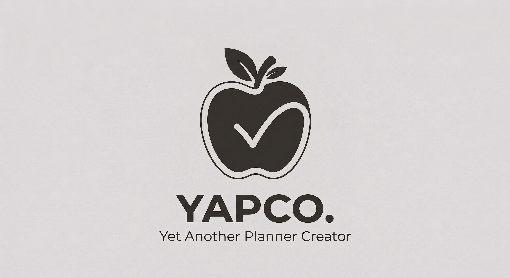
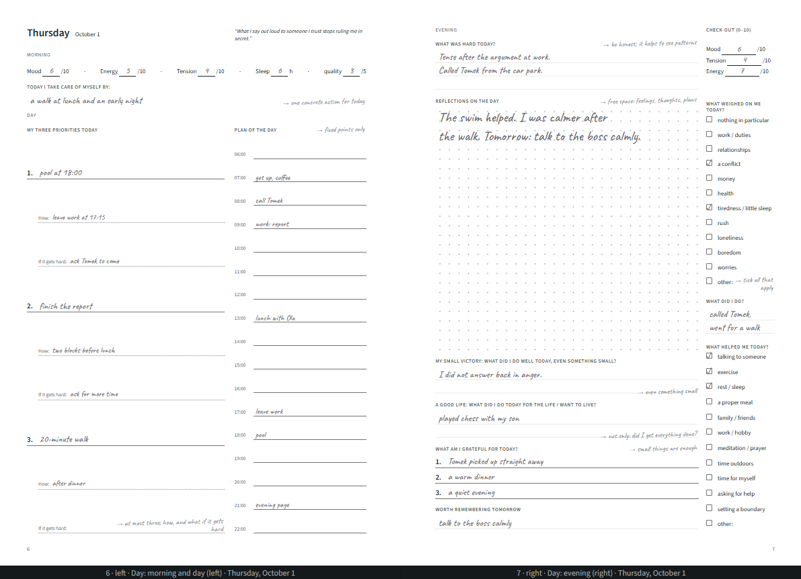
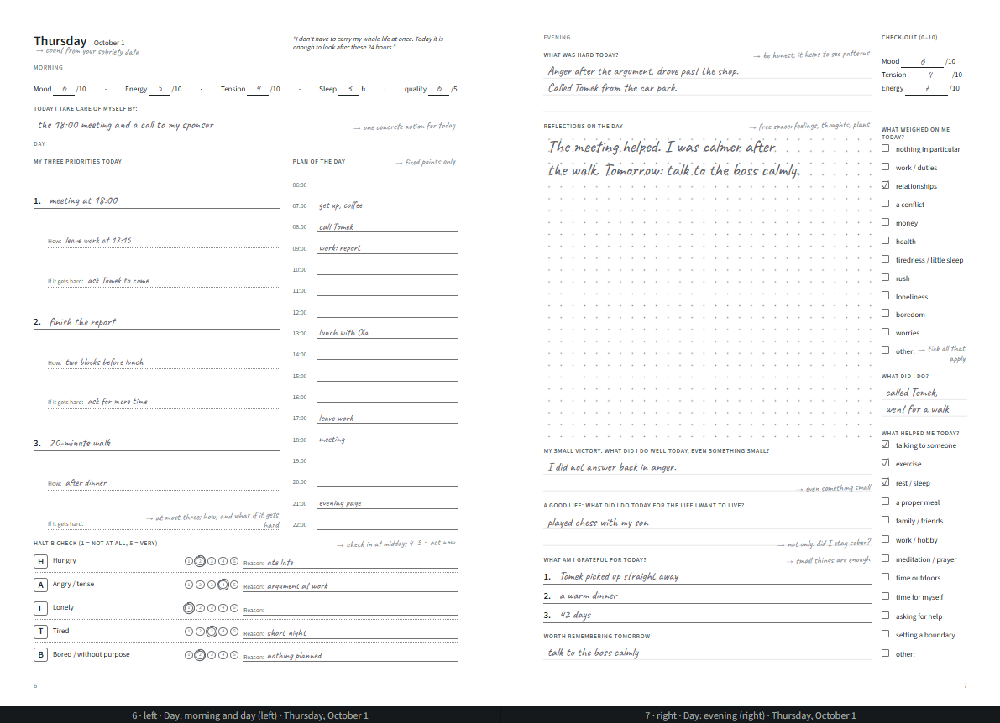
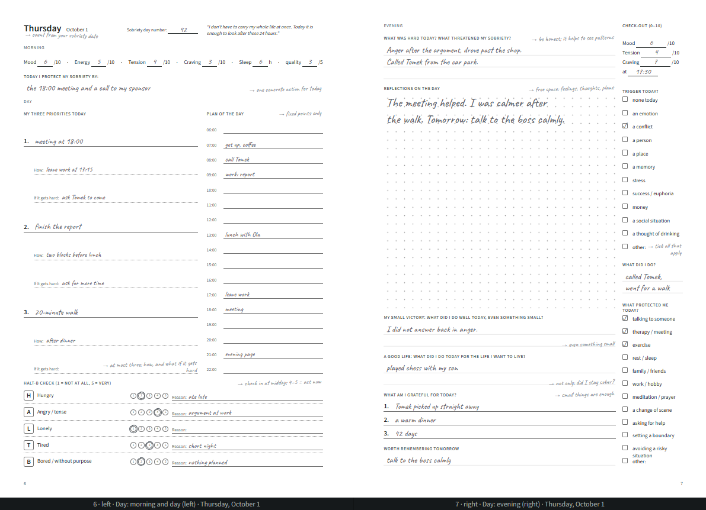
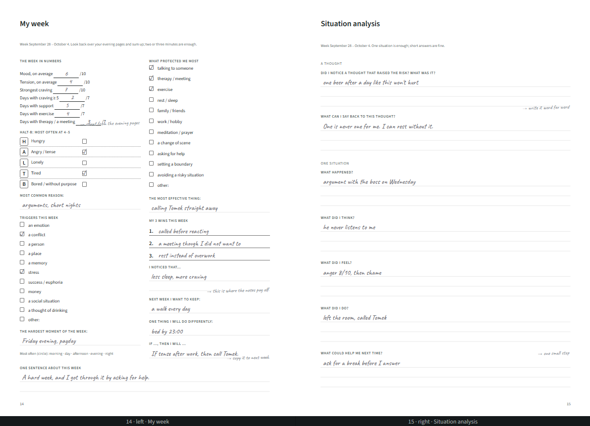
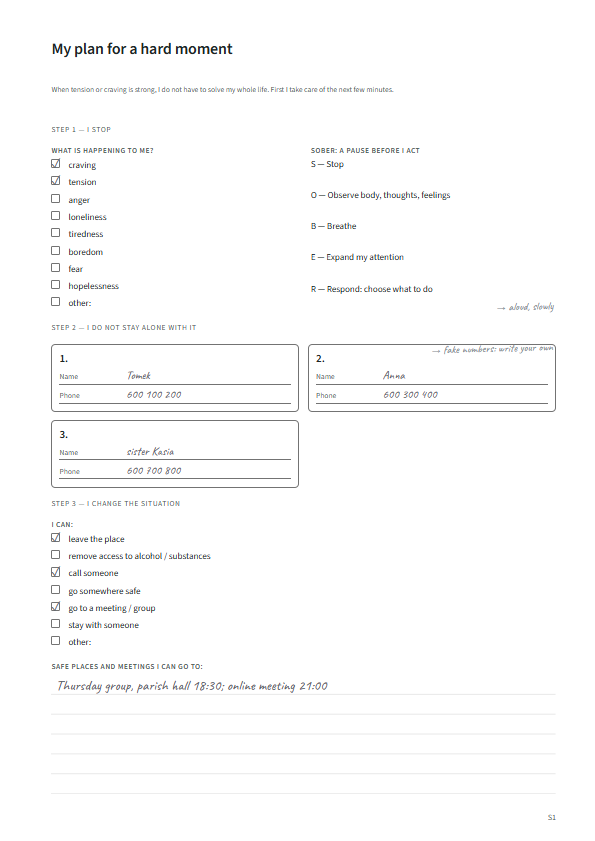
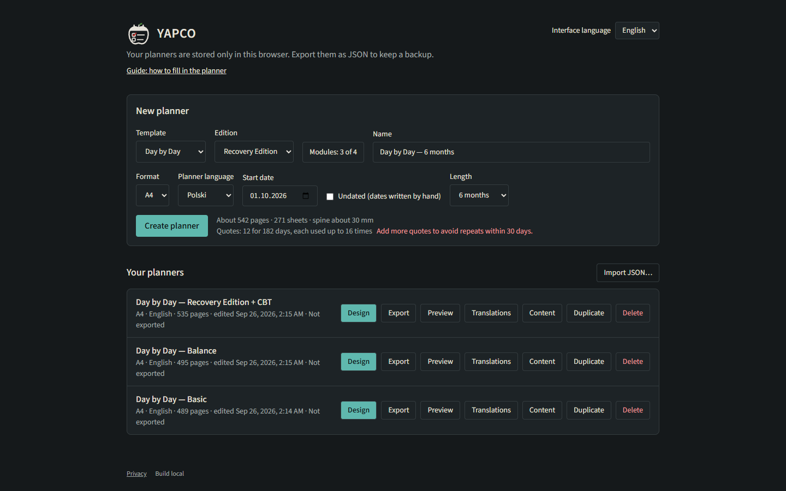
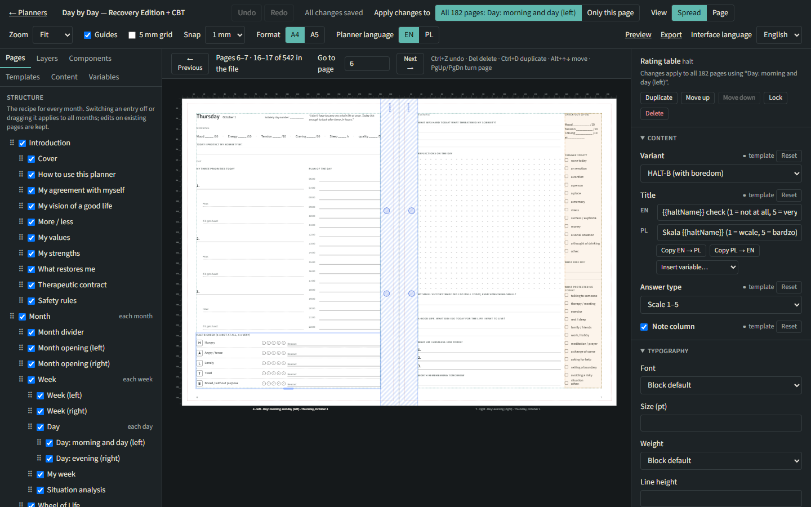
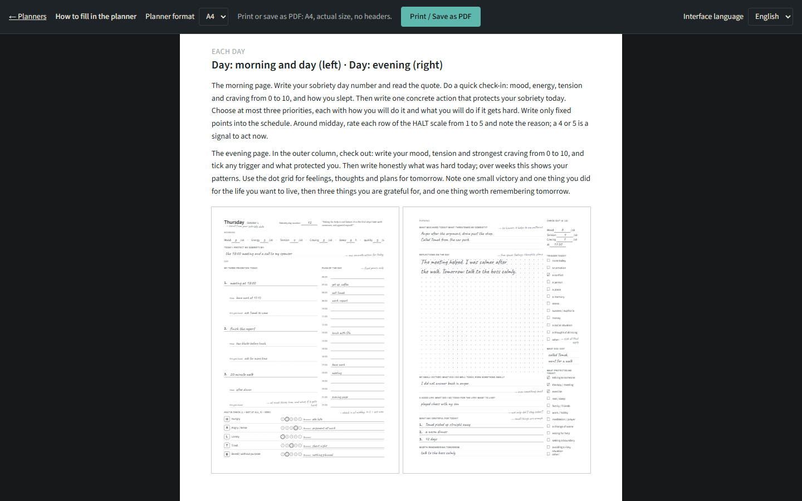
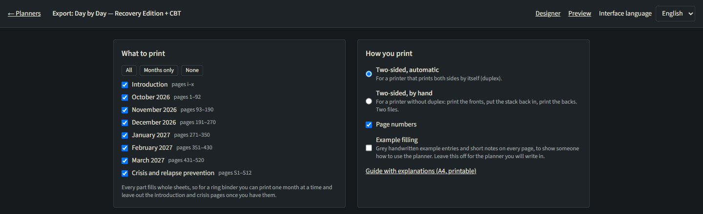

<p align="center"></p>

<p align="center">
  <strong>Design, customise and print bilingual paper planners, page by page.</strong><br>
  Polish / English · A4 / A5 · print-ready PDF · everything stays in your browser
</p>

<p align="center">
  <a href="https://github.com/mdyzma/yapco/actions/workflows/ci.yml"></a>
  
  
  
  <a href="LICENSE"></a>
</p>

---

**YAPCO** (*Yet Another Planner Creator*) turns a planner **template** into a complete, dated,
print-ready planner in **A4** (210 × 297 mm) or **A5** (148 × 210 mm): hundreds of pages laid
out for two-sided printing, with mirrored margins for the binding, in Polish or English. You print it blank on your own printer, fill it in by
hand and put it in a ring binder.

The first template is **"Dzień po Dniu" / "Day by Day"**, a six-month planner for everyday life,
balance and a good life. It comes in two editions: **Recovery Edition**, for recovery from
addiction, and **Balance**, in neutral everyday wording. The second, **"Tydzień po Tygodniu" /
"Week by Week"**, is a simple weekly planner for up to a year, made from the same engine.

## Contents

- [What you can do](#what-you-can-do)
- [Screenshots](#screenshots)
- [Quick start](#quick-start)
- [Repository layout](#repository-layout)
- [How it works](#how-it-works)
- [Documentation](#documentation)
- [Contributing](#contributing)

## What you can do

| | |
| --- | --- |
| 🗓️ **Generate a whole planner** | Pick a template, edition, format (A4 or A5), language, start date and length; YAPCO lays out every month, week and day, 500+ pages for six months. |
| 📐 **A4 and A5** | Every page is designed for both formats, not just scaled: A5 gets its own layout where space is tight (a two-line check-in, fewer writing lines, compact contacts on the crisis plan). Switch the format at any time; your edits carry over. A5 can also print two per A4 sheet. |
| 🧩 **Switch modules on and off** | Editions are presets of modules (recovery, HALT-B, CBT situation analysis, "A good start"). Wording, pages and blocks follow what is on. |
| ✏️ **Design visually** | A three-panel designer: page structure, a real-size canvas with guides and binding margins, and a properties panel. Edit one page or every page made from the same template. |
| 🌍 **Work in two languages** | Every text has Polish and English side by side, including gendered Polish wording; the app itself is bilingual. |
| 🖨️ **Print at home** | PDF export for two-sided printers or by-hand duplex, 2-up A5 on A4, a calibration sheet, and one month at a time for a ring binder. |
| 📖 **Show how to use it** | Example filling in grey handwriting, and a printable guide that explains every page. |
| 🔒 **Keep it private** | Planners are stored only in the browser (IndexedDB); export them as JSON for backups. No accounts, no server database. |
| 📴 **Works offline** | Installable as an app (PWA); after the first visit it opens and works without a connection. Only PDF creation needs the export service; printing from the browser works offline. |

## Screenshots

### One template, any kind of planner

The same template makes a simple day planner, a wellbeing journal or a full therapeutic
recovery planner. Modules add or remove pages, blocks and wording; the pages below are the same
day of the same planner, with the example filling switched on.

<table>
  <tr>
    <th width="33%">Basic</th>
    <th width="33%">Wellbeing (Balance)</th>
    <th width="33%">Recovery (Recovery Edition + CBT)</th>
  </tr>
  <tr>
    <td><a href="docs/images/readme/day-basic.png"></a></td>
    <td><a href="docs/images/readme/day-balance.png"></a></td>
    <td><a href="docs/images/readme/day-recovery.png"></a></td>
  </tr>
  <tr>
    <td>All modules off: check-in, priorities, plan of the day and an evening review.</td>
    <td>Adds the HALT-B check and the "A good start" pages; neutral everyday wording.</td>
    <td>Adds sobriety days, craving scales, triggers, the crisis section and the weekly CBT
    situation analysis.</td>
  </tr>
</table>

The recovery set-up goes as far as a therapeutic workbook: a weekly review with a situation
analysis, and a crisis plan with the SOBER pause, contacts and safe places.

<table>
  <tr>
    <td width="66%"><a href="docs/images/readme/recovery-cbt.png"></a></td>
    <td width="34%"><a href="docs/images/readme/recovery-crisis.png"></a></td>
  </tr>
  <tr>
    <td>"My week" and "Situation analysis" (CBT module)</td>
    <td>"My plan for a hard moment" (crisis section)</td>
  </tr>
</table>

### The app

**Create a planner.** Pick the template, edition and modules, format, language and dates; the
page count and spine width update as you go. Each set-up above is one planner on the list.



**Design the pages.** Browse the planner's sections and pages on the left, lay out the page in
the visual designer in the centre, and adjust every element to your needs in the properties
panel on the right.



**Explain it.** A printable guide walks through every page with a filled-in example.



**Print it.** Pick the parts to print and how your printer handles two-sided pages.



## Quick start

**Requirements:** Node.js 24 (see `.nvmrc`; 22+ works), pnpm through Corepack, and Google
Chrome for PDF export.

```bash
git clone https://github.com/mdyzma/yapco.git
cd yapco
corepack enable
pnpm install
pnpm dev
```

`pnpm dev` starts the app on <http://localhost:3000> and the local PDF export service on
`:8787`, which drives your installed Chrome ([apps/export-node](apps/export-node/README.md)).

| Command | What it does |
| --- | --- |
| `pnpm dev` | App and export service in watch mode |
| `pnpm check` | Lint, typecheck, tests and build, the same as CI |
| `pnpm test` | All unit tests (Vitest) |
| `pnpm --filter @planner/template-therapeutic-recovery build:template` | Rebuild `template.json` after editing the template source (`@planner/template-weekly-planner` for the weekly one) |
| `pnpm --filter @planner/export-node pdf <planner.json>` | Make a PDF from the command line |

For everyday use (printing a month, backups, updating, troubleshooting) see the
**[runbook](docs/operations/runbook.md)**.

## Repository layout

```text
yapco/
├── apps/
│   ├── web/                    Next.js app: dashboard, designer, preview, export, guide
│   │                           (static export, next-intl, data in IndexedDB)
│   ├── export-node/            Local PDF service and CLI (headless Chrome via playwright-core)
│   └── worker/                 Cloudflare Worker: serves the site, renders PDFs with Browser Run
├── packages/
│   ├── planner-schema/         Zod schemas, types, migrations, defaults
│   ├── planner-i18n/           Translation lookup, dates, plurals, gendered wording
│   ├── planner-core/           Pagination (sides, spreads, fillers), page geometry, modules
│   ├── planner-renderer/       React page rendering in millimetres, guides, print CSS
│   ├── planner-blocks/         Block registry and built-in blocks (text, lists, HALT, calendar,
│   │                           Wheel of Life, contacts, images…)
│   ├── planner-generator/      Calendar planning, template expansion, content dealing, page budget
│   ├── planner-content/        Content checks, CSV import/export, filters
│   ├── planner-editor/         Designer commands, edit scope, undo history
│   ├── planner-pdf/            Export plan, merging, imposition (2-up, manual duplex), calibration
│   └── planner-storage/        Repository interfaces, IndexedDB (Dexie) and in-memory stores
├── templates/
│   ├── therapeutic-recovery/   "Day by Day": TypeScript source → template.json, quotes, examples
│   └── weekly-planner/         "Week by Week": a simple weekly planner, the second template
└── docs/
    ├── architecture/           System design
    ├── adr/                    Architecture decision records
    ├── operations/             Runbook, Cloudflare deployment
    ├── brand/                  Logo and brand concepts
    └── roadmap.md              What is done and what comes next
```

## How it works

```text
template (TS → JSON)  ──►  generator  ──►  planner document  ──►  renderer  ──►  PDF
   pages, blocks,          dates, months,     pages with sides,     React in mm,     Chrome
   modules, presets        weeks, quotes      overrides, modules    print CSS        print
```

- A **template** describes sections, page templates and blocks, with Polish and English text in
  the same record. Modules and presets decide which pages print and which wording a block uses
  ([ADR-0010](docs/adr/0010-modules-presets-and-block-variants.md)).
- The **generator** expands the template for a start date and length into concrete pages, knows
  which side each page falls on, and inserts fillers so that sections start on the right side.
- The **designer** edits either one page or the page template it came from; your edits survive
  regenerating the planner.
- The **renderer** draws pages in real millimetres; Chrome prints them to PDF, so text stays
  vector and sizes are exact.

Built with TypeScript, React 19, Next.js 16, next-intl, Zod 4, Zustand, dnd-kit, Tailwind CSS,
Dexie, Vitest, Turborepo and pnpm.

## Documentation

- [System design](docs/architecture/system-design.md): the whole architecture and delivery plan
- [Decisions (ADRs)](docs/adr/): monorepo, layout model, overrides, PDF, print profiles, hosting,
  editor commands, modules
- [Roadmap](docs/roadmap.md): content reviews, what is done, what is next
- [Runbook](docs/operations/runbook.md) and [Cloudflare deployment](docs/operations/cloudflare.md)
- [The "Day by Day" template](templates/therapeutic-recovery/README.md) and the
  ["Week by Week" template](templates/weekly-planner/README.md)

## Contributing

Issues and pull requests are welcome. See [CONTRIBUTING.md](CONTRIBUTING.md) for the set-up,
conventions and how to add a block, a page or a template.

## Licence

[MIT](LICENSE) © 2026 Michal Dyzma
